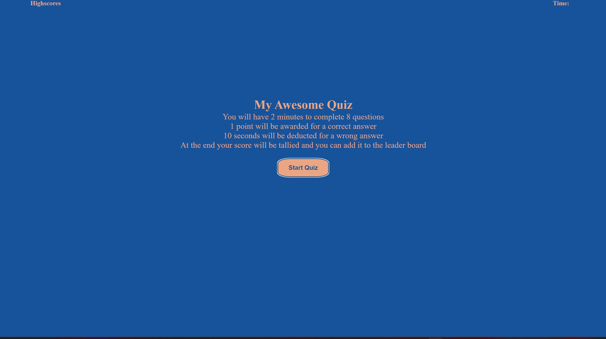
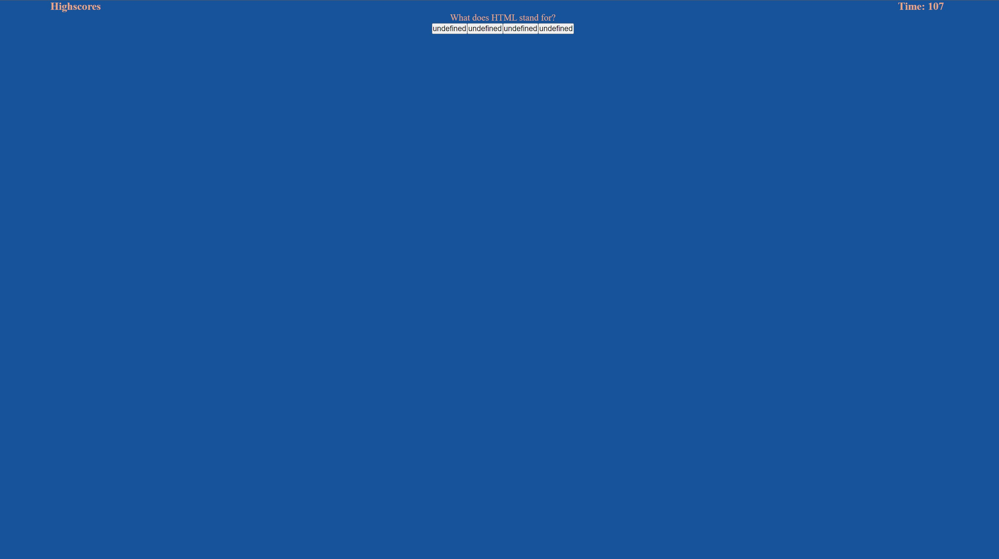

# Thetoughestquizever

## Description
This was a tough challenge for me mentally. I tried doing the exercise a couple different ways but couldn't get it to work I was trying to find help online but everytime I would try doing it the way they would say I would have to restart almost the entire code cause they were doing it a different way this method worked the best for me even though I ran out of time. I got so far as to start my quiz and you can read the questions but the answers say undefined and couldn'y figure out how to change that. One positive though is that I came out of this with a better understanding of CSS things started to click for me.

## Installation

you can download my code at my github repo found below:

https://github.com/jarrettbutler/Thetoughestquizever

Screenshots of my website when functioningish

## Usage
If it worked you could do a quiz on basic HTML/CSS/JavaScript.

## License
Please check github repo for license
